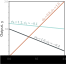
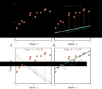

# 第二章 监督学习（Supervised Learning）
监督学习模型就是将一个或多个输入转化为一个或多个输出的方式。比如，我们可以将某部二手丰田普锐斯的车龄和行驶里程作为输入，预估的车辆价格则是输出。

这个模型其实只是个数学公式；当我们把输入放入这个公式进行计算，我们得到的结果就是所谓的“推理”。这个公式还包含一些参数。改变参数值会改变计算的结果；这个公式其实描述了输入和输出之间所有可能关系的“家族”，而参数则定义了其中的特定关系。

每当我们训练或学习模型时，我们其实是在寻找可以真实反映输入与输出关系的参数。学习算法收集一组输入/输出对，然后调整这些参数，使得输入数据能够尽可能准确地预测出其相应的输出。如果对于这些训练数据，模型的预测效果不错，那么我们就会寄希望于它能在未来遇到新的未知输出的情况下，依然能做出好的预测。

本章的目标是深入探讨这些观点。我们会首先对这个框架进行更详细的描述，并引入一些专业的符号。然后，我们会用一个简单的范例来展示如何使用一条直线来描述输入与输出间的关系。这个线性模型比较容易理解且直观，却恰好包含了所有有监督学习的关键概念。
## 2.1 监督学习介绍
在监督学习中，我们的目标是建立一个模型，这个模型能够接收输入 x 并给出预测结果 y。简单来说，我们假设输入 x 和输出 y 都是预先定义且大小固定的向量，并且这些向量中的元素排列顺序始终一致。举个例子，如普锐斯汽车的例子，输入 x 总是先包含汽车的年龄，然后是行驶里程，按照这个顺序。这种数据被称为结构化或表格数据（structured or tabular data）。

为了进行预测，我们需要一个函数模型 f[•]，它以 x 为输入并返回预测结果 y，即：

$$
y = f[x] \tag{2.1}
$$

当我们根据输入 x 来计算预测结果 y 时，这个过程称为推理（inference）。

这个模型实际上是一个具有固定形式的数学方程，代表了输入和输出之间各种不同的关系。模型中也包含一些参数 $\phi$。这些参数的选择决定了输入和输出之间具体的关系。更准确地说，我们应该这样表达这个关系：

$$
y = f[x, \phi] \tag{2.2}
$$

当我们谈及学习或训练模型时，意味着我们在尝试找出能够根据输入合理预测输出的参数 $\phi$。我们通过一组包含 I 对输入和输出样本 ${x_i, y_i}$ 的训练数据集来学习这些参数。我们的目标是选取能够尽可能准确地将每一个训练输入映射到它对应的输出的参数。我们通过损失函数 L 来衡量这种映射的准确程度。损失函数是一个标量值，它概括了模型基于当前参数 $\phi$ 预测训练数据输出与实际输入的不匹配程度。

我们可以把损失函数视为参数的函数 $L[\phi]$。在训练模型时，我们的目标是寻找一组参数 $\hat \phi$，这组参数能够使损失函数的值最小：

$$
\hat \phi = \arg \mathop{\min}\limits_{\phi} L [\phi] \tag{2.3}
$$

如果在这个最小化过程之后损失很小，说明我们找到了一组能够从训练输入 $x_i$ 准确预测训练输出 $y_i$ 的模型参数。

在训练模型之后，我们接下来需要评估它的性能。我们会在一组独立的测试数据上运行模型，以评估它对于训练过程中未曾见过的示例的泛化能力。如果模型的性能达到预期，那么我们就可以开始部署这个模型了。

## 2.2 线性回归示例
让我们通过一个简单的实例，将这些理论概念具体化。假设有一个模型 $y = f[x, \phi]$，它能够根据某个输入 x，预测出单一的输出 y。接着，我们将构建一个损失函数，并就如何训练这个模型进行讨论。
### 2.2.1 一维线性回归模型
一维线性回归模型以一条直线的形式，展现了输入x和输出y之间的关系：

$$
y = f[x, \phi] = \phi_0 + \phi_1 x \tag{2.4}
$$

图2.1 线性回归模型。在我们确定了参数 $\phi = [\phi_0 , \phi_1 ]^T$ 的选择后，该模型就可以依据输入值（x轴位置）来预测输出值（y轴位置）。通过调整y轴截距 $\phi_0$ 和直线斜率 $\phi_1$ 的值，我们的预测结果（代表为青色、橙色以及灰色线）也就有所不同。所以，线性回归模型（公式 2.4）实际上就定义了一个输入/输出关系的集合（代表为多条直线），而模型的参数则用来确定我们将使用的具体一条直线（即集合中的一个成员）。

这个模型有两个参数 $\phi = [\phi_0,\phi_1]^T$，$\phi_0$ 和 $\phi_1$ 分别代表直线的截距和斜率。调整截距和斜率的值，可以改变输入和输出之间的关系（如图 2.1 所示）。因此，我们可以认为方程 2.4 描述的是一族可能的输入-输出关系（即：所有可能的线）。而具体选择哪个参数，就能确定这一族关系中的特定成员（也就是特定的一条直线）。

### 2.2.2 损失（Loss）

对于这个模型，训练数据集（见图 2.2a）由 I 对输入/输出数据对 ${x_i, y_i}$ 组成。图 2.2b–d 展示了三组不同参数定义下的三条线。图 2.2d 中的绿色线条比其他两条更准确地描述了数据，因为它更接近于数据点。然而，我们需要一种系统的方法来判断哪一组参数 $\phi$ 比其他参数更优。为了做到这一点，我们给每一组参数赋予一个数值，这个数值表示模型与数据之间不匹配的程度。我们称这个值为损失；损失越低，表示模型拟合得越好。

这种不匹配是通过模型预测 $f[x_i,\phi]$（线在 xi 处的高度）和真实输出 $y_i$ 之间的差异来表示的。在图 2.2b–d 中，这些差异以橙色虚线显示。我们通过计算所有 I 对训练数据对中这些差异的平方和来量化总的不匹配、训练误差或损失：

$$
L(\phi) = \sum_{i=1}^{I} (f(x_i; \phi) - y_i)^2 = \sum_{i=1}^{I} (\phi_0 + \phi_1 x_i - y_i)^2 \tag{2.5}
$$

由于最佳参数是使这个表达式最小化的参数，我们称之为最小二乘损失。平方操作意味着偏差的方向（即线是在数据点上方还是下方）不重要。我们将在第 5 章回到这个选择的理论原因。

Figure 2.2 线性回归中的训练数据，模型和损失的展示。a）我们的训练数据（标注为橙色的点）包含着 I = 12 个输入输出对 {$x_i , y_i$ }。b–d）每一部分都展示了一个具有不同参数的线性回归模型。根据我们选择的截距和斜率参数 $\phi = [\phi_0 , \phi_1 ]^T$，模型的预测结果（表示为橙色的虚线）的误差可能会变大或变小。这里的损失 L 实际上就是这些误差的平方和。如果你看一下图表 b 和 c，你会发现其线条拟合的并不是很好，这使得它们的损失 L 分别为 7.07 和 10.28，这是相当大的损失。而在图表 d 中，该模型拟合得相当好，导致其损失 L 仅为 0.20；实际上，这就是所有可能的线条中损失最小的那一条，可以认为这些参数是最优的。

损失 L 是参数 $\phi$ 的函数；当模型拟合较差时（如图 2.2b,c），损失会较大；而拟合良好时（如图 2.2d），损失则较小。从这个角度来看，我们称 $L[\phi]$ 为损失函数或成本函数。目标是找到能最小化这个量的参数 $\hat \phi$：

$$
\begin{align}
\hat{\phi} &= \underset{\phi}{\mathrm{argmin}} \, L(\phi) \\
&= \underset{\phi}{\mathrm{argmin}} \, \left[ \sum_{i=1}^{I} (f(x_i; \phi) - y_i)^2 \right] \\
&= \underset{\phi}{\mathrm{argmin}} \, \left[ \sum_{i=1}^{I} (\phi_0 + \phi_1 x_i - y_i)^2 \right] \tag{2.6}
\end{align}
$$
由于模型只有两个参数（y 截距 $\phi_0$ 和斜率 $\phi_1$），我们可以为每一组参数值的组合计算损失，并将损失函数以表面的形式进行可视化（见图 2.3）。"最佳" 参数则位于这个表面的最低点。

### 2.2.3 训练
寻找使损失最小化的参数的过程称为模型拟合、训练或学习。这个过程的基本方法是首先随机选择初始参数，然后通过不断“下降”损失函数，直到找到最低点（参见图 2.4）。具体做法是，测量当前位置损失函数表面的梯度，然后朝最陡峭的下坡方向迈出一步。接着不断重复这个过程，直到梯度变平，无法再进一步优化。

### 2.2.4 测试
当模型训练完成后，我们想知道它在实际应用中的表现。这可以通过在一组独立的测试数据上计算损失来实现。模型预测的准确性在多大程度上能泛化到测试数据，一方面取决于训练数据的代表性和完整性；另一方面，则取决于模型的表达能力。例如，简单的模型如直线可能无法完全捕捉输入和输出之间的真实关系，这就是所谓的欠拟合。相反，表达能力过强的模型可能会描述训练数据中的一些不典型的统计特性，导致不正常的预测结果，这被称为过拟合。

## 2.3 概要
监督学习模型是一个函数 $y = f[x, \phi]$，它将输入 x 与输出 y 关联起来。这种特定的关系由参数 φ 决定。为了训练模型，我们在训练数据集 {$x_i, y_i$} 上定义了损失函数 $L[\phi]$，以量化模型预测 $f[x_i,\phi]$ 与实际观测输出 yi 之间的不匹配程度。然后我们寻找能够最小化这个损失的参数。我们通过在不同的测试数据集上评估模型，来检查它对新输入的泛化能力。

接下来的第 3-9 章将进一步深入这些概念。首先，我们将探讨模型本身。1D 线性回归的明显限制是，它只能以直线形式描述输入和输出之间的关系。第 3 章介绍的浅层神经网络虽然比线性回归稍复杂，但能描述更广泛的输入/输出关系。第 4 章的深度神经网络在保持表达能力的同时，能用更少的参数描述复杂函数，且在实际应用中表现更佳。

第 5 章将探讨不同任务下的损失函数及其理论基础，特别是最小二乘损失。第 6 章和第 7 章将讨论训练过程，第 8 章将讨论如何衡量模型性能，而第 9 章将考察旨在提高性能的正则化技术。

## Notes

**损失函数（loss Function）与成本函数（cost function）**：在机器学习领域，尤其是在本书中，“损失函数”和“成本函数”这两个术语通常可以互换使用。但更准确地说，损失函数是指与单个数据点相关的具体项（例如，方程 2.5 中每个平方项），而成本函数是指需要被最小化的整体量（即方程 2.5 中的整个右侧部分）。成本函数可能还包含与单个数据点无关的其他项（详见第 9.1 节）。更广义上，目标函数指的是任何需要最大化或最小化的函数。

**生成(Generative)模型与判别(Discriminative)模型**：本章中提到的模型 $y = f[x, \phi]$ 属于判别模型。这类模型基于实际测量的数据 x 来预测输出 y。另一种方法是构建生成模型 $x = g[y, \phi]$，在这种模型中，实际测量的数据 x 被看作是输出 y 的函数。
虽然生成模型的缺点是它们不直接预测 y，但它们的优势在于能够融入关于数据生成方式的先验知识。比如，如果我们要预测图像 x 中汽车的三维位置和方向 y，我们可以在函数 $x = g[y, \phi]$ 中加入关于汽车形状、三维几何和光传输的知识。
尽管这听起来是个好主意，但实际上，在现代机器学习中，判别模型更为主流。这是因为在生成模型中利用先验知识所带来的优势通常不及利用大量训练数据来学习灵活的判别模型所获得的优势。
## 课后习题
**问题 2.1** 为了在损失函数（方程 2.5）上实现“downhill”，我们需要计算它对参数 $\phi_0$ 和 $\phi_1$ 的梯度。请计算出这两个参数的梯度值 $\partial L / \partial \phi_0$ 和 $\partial L / \partial \phi_1$ 的具体表达式。

**问题 2.2** 请证明我们可以通过将问题 2.1 中的导数设置为零，然后求解 $\phi_0$ 和 $\phi_1$，以闭合形式找到损失函数的最小值。需要注意的是，这种方法适用于线性回归，但不适用于更复杂的模型；这就是为什么我们通常会使用迭代的模型拟合方法，例如梯度下降（参见图 2.4）。

**问题 2.3∗** 考虑将线性回归改造为生成模型，形式为 $x = g[y, \phi] = \phi_0 + \phi_1 y$。请问这种情况下的新损失函数是什么？请找出进行推理所需的逆函数 $y = g^{-1}[x, \phi]$ 的表达式。对于一个给定的训练数据集 {${x_i,y_i}$}，这个模型是否会做出与判别模型版本相同的预测？一种验证方法是编写程序，使用这两种方法对三个数据点进行线性拟合，看结果是否一致。

## 习题答案：
### 问题2.1

给定的损失函数是：
$$ 
L(\phi) = \sum_{i=1}^{I} (\phi_0 + \phi_1 x_i - y_i)^2 
$$
我们需要计算两个参数 $\phi_0$ 和 $\phi_1$ 的梯度。这里的梯度是损失函数对这两个参数的偏导数。

对 $\phi_0$ 的偏导数，应用链式法则：

$$
\begin{aligned}
\frac{\partial L}{\partial \phi_0} &= \frac{\partial}{\partial \phi_0} \sum_{i=1}^{I} (\phi_0 + \phi_1 x_i - y_i)^2 \\
&= \sum_{i=1}^{I} 2(\phi_0 + \phi_1 x_i - y_i) \cdot \frac{\partial}{\partial \phi_0} (\phi_0 + \phi_1 x_i - y_i) \\
&= \sum_{i=1}^{I} 2(\phi_0 + \phi_1 x_i - y_i) \cdot 1 \\
&= \sum_{i=1}^{I} 2(\phi_0 + \phi_1 x_i - y_i)
\end{aligned}
$$

对 $\phi_1$ 的偏导数同样应用链式法则：

$$
\begin{aligned}
\frac{\partial L}{\partial \phi_1} &= \frac{\partial}{\partial \phi_1} \sum_{i=1}^{I} (\phi_0 + \phi_1 x_i - y_i)^2 \\
&= \sum_{i=1}^{I} 2(\phi_0 + \phi_1 x_i - y_i) \cdot \frac{\partial}{\partial \phi_1} (\phi_0 + \phi_1 x_i - y_i) \\
&= \sum_{i=1}^{I} 2(\phi_0 + \phi_1 x_i - y_i) \cdot x_i
\end{aligned}
$$
综上所述，梯度的具体表达式是：

$$ \frac{\partial L}{\partial \phi_0} = \sum_{i=1}^{I} 2(\phi_0 + \phi_1 x_i - y_i) $$
$$ \frac{\partial L}{\partial \phi_1} = \sum_{i=1}^{I} 2(\phi_0 + \phi_1 x_i - y_i) x_i $$
### 问题2.2
为了找到损失函数的最小值，我们可以将导数（梯度）设置为零，并解这些等式来找到 $\phi_0$ 和$\phi_1$ 。这种方法适用于线性回归，因为损失函数是关于参数的二次函数，从而形成了一个凸函数。在凸函数中，任何局部最小值也是全局最小值，因此通过解析方法可以找到这个最小值。
#### 步骤 1: 设置梯度为零
我们上面已经得到了损失函数 $L(\phi)$ 关于 $\phi_0$ 和$\phi_1$ 的梯度，为了找到最小值，我们将这些导数设置为零：

$$
\begin{align}
\sum_{i=1}^{I} 2(\phi_0 + \phi_1 x_i - y_i) = 0 \\
\sum_{i=1}^{I} 2(\phi_0 + \phi_1 x_i - y_i) x_i  = 0
\end{align}
$$
#### 步骤 2: 解这些方程
我们可以通过解这两个方程来找到 $\phi_0$ 和$\phi_1$ 的值。首先，我们简化这两个方程：
$$
\begin{align}
\sum_{i=1}^{I} (\phi_0 + \phi_1 x_i - y_i) = 0 \\
\sum_{i=1}^{I} (\phi_0 + \phi_1 x_i - y_i) x_i = 0
\end{align}
$$
然后，我们展开这些求和：
$$
\begin{align}
I\phi_0 + \phi_1 \sum_{i=1}^{I} x_i - \sum_{i=1}^{I} y_i = 0 \\
\phi_0 \sum_{i=1}^{I} x_i + \phi_1 \sum_{i=1}^{I} x_i^2 - \sum_{i=1}^{I} y_i x_i = 0
\end{align}
$$
现在，我们有了两个方程和两个未知数 $\phi_0$ 和$\phi_1$ 。这是一个线性方程组，可以使用标准的代数方法（例如高斯消元法或矩阵求逆）来解。
#### 注意事项
虽然这种方法对于线性回归是有效的，但对于更复杂的模型（如具有非线性关系或更多参数的模型）通常不可行。在这些情况下，我们通常会使用迭代方法（如梯度下降），因为它们不依赖于能够解析地解方程，并且可以处理非凸函数，其中可能存在多个局部最小值。

### 问题2.3
当我们将线性回归模型转换为生成模型时，模型的形式变为 $x = g[y, \phi] = \phi_0 + \phi_1 y$。在这种情况下，我们的目标是最小化 x和 $g[y, \phi]$ 之间的差异。
#### 新损失函数
新的损失函数将是 x 和生成的 x （即 $g[y, \phi]$）之间的差的平方和。因此，新的损失函数 $L'(\phi)$ 可以表示为：

$$
\begin{align}
L'(\phi) &= \sum_{i=1}^{I} (x_i - g[y_i, \phi])^2 \\
&= \sum_{i=1}^{I} (x_i - (\phi_0 + \phi_1 y_i))^2 
\end{align}
$$

#### 逆函数
为了找到逆函数 $g^{-1}[x, \phi]$，我们需要重新排列 $x = \phi_0 + \phi_1 y$ 来解出  y：
$$
\begin{align}
x = \phi_0 + \phi_1 y \\
x - \phi_0 = \phi_1 y \\ 
y = \frac{x - \phi_0}{\phi_1}
\end{align}
$$
因此，逆函数 $g^{-1}[x, \phi]$ 是：

$$
g^{-1}[x, \phi] = \frac{x - \phi_0}{\phi_1} 
$$
#### 模型预测比较
在这种情况下，生成模型和判别模型版本是否会做出相同的预测取决于模型的学习方式。判别模型直接学习了从 y 到 x 的映射，而生成模型学习了从 x 到 y 的映射，然后我们求逆以进行预测。

尽管在数学上这两种模型可能似乎应该提供相同的预测，但在实际操作中，由于诸如数值稳定性、拟合方法（如最小二乘法与梯度下降）等因素，它们可能会产生略有不同的结果。验证这一点的一种方法是，对于一个简单的数据集（如三个数据点），分别使用这两种方法进行线性拟合，并比较结果。在实际应用中，这种比较通常是通过编程实现的。
