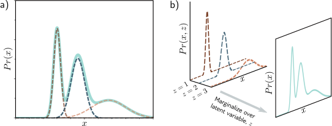
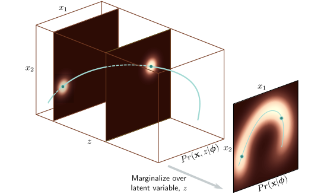
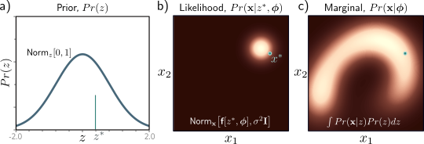
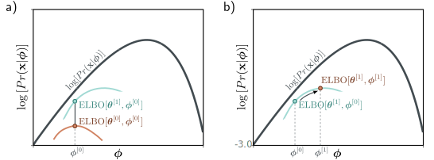
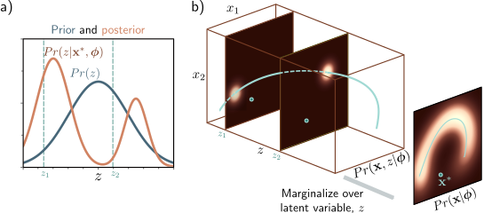
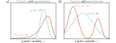

生成对抗网络 (Generative Adversarial Networks) 学习了一种机制，可以生成与训练数据 {x_i} 在统计上无法区分的样本。与此相对，像归一化流（normalizing flows）、变分自编码器 (Variational Autoencoders, VAEs) 这类的概率生成模型 (probabilistic generative models) 则旨在学习覆盖数据的分布 P r(x) （见图 14.2）。训练结束后，可以从该分布中抽取（生成）样本。然而，由于 VAE 的特性，遗憾的是无法精确计算新样本 x∗ 的概率。

虽然人们通常会将 VAE 视为 P r(x) 的模型，但这种说法有误导性；VAE 实际上是一种神经架构，设计用于帮助学习 Pr(x) 的模型。P r(x) 的最终模型既不包括“变分”也不包括“自编码器”部分，更准确地说，它应被描述为一个非线性潜在变量模型 (nonlinear latent variable model)。

本章首先对潜在变量模型 (latent variable models) 进行概述，然后特别讨论非线性潜在变量模型的情况。我们将了解到，对这种模型进行最大似然估计 (maximum likelihood learning) 并非易事。尽管如此，还是可以定义似然的下界，并且 VAE 架构采用蒙特卡罗 (Monte Carlo, 抽样) 方法来近似这个下界。本章最后将介绍 VAE 的几个应用案例。
## 17.1 潜在变量模型

潜在变量模型 (Latent variable models) 采取了一种间接的方法来描述多维变量 $x$ 上的概率分布 $Pr(x)$。它们不直接给出 $Pr(x)$ 的表达式，而是构建数据 $x$ 与未观测的*隐变量*（*latent variable*）$z$ 的联合分布 $Pr(x, z)$。接着，通过将这个联合概率边缘化来描述 $Pr(x)$ 的概率，形式为：

$$
Pr(x) = \int Pr(x, z)dz.
$$

一般情况下，联合概率 $Pr(x, z)$ 通过条件概率规则被分解为关于潜变量的*似然*（likelihood）$Pr(x|z)$ 和*先验*（prior）$Pr(z)$：

$$
Pr(x) = \int Pr(x|z)Pr(z)dz.
$$
(17.2)

虽然这是描述 $Pr(x)$ 的一种较间接的方法，但由于 $Pr(x|z)$ 和 $Pr(z)$ 的表达式相对简单，它可以用来定义 $Pr(x)$ 的复杂分布。

### 17.1.1 示例：高斯混合

在一维高斯混合模型（图 17.1a）中，潜在变量 $z$ 是离散的，其先验 $Pr(z)$ 为分类分布（图 5.9），每个可能的 $z$ 值对应一个概率 $\lambda_n$。当潜变量 $z$ 取值为 $n$ 时，数据 $x$ 的似然 $Pr(x|z = n)$ 符合均值为 $\mu_n$、方差为 $\sigma^2_n$ 的正态分布：

$$
Pr(z = n) = \lambda_n
$$
$$
Pr(x|z = n) = \mathcal{N}_{x}(\mu_n, \sigma^2_n).
$$
(17.3)

正如方程 17.2 中所示，$Pr(x)$ 的似然通过对潜变量 $z$ 进行边缘化得到（图 17.1b）。在这里，潜变量是离散的，因此我们对其所有可能的值进行求和以实现边缘化：

$$
Pr(x) = \sum_{n=1}^{N} Pr(x, z = n)
$$
$$
= \sum_{n=1}^{N} Pr(x|z = n) \cdot Pr(z = n)
$$
$$
= \sum_{n=1}^{N} \lambda_n \cdot \mathcal{N}(\mu_n, \sigma^2_n).
$$
(17.4)

从简单的似然和先验表达式出发，我们描述了一个复杂的多峰概率分布。

`图 17.1 高斯混合模型 (MoG)。a) 高斯混合模型将一个复杂的概率分布（青色曲线）表达为多个高斯分量（虚线曲线）的加权和。b) 该加权和即是通过边际化过程，将连续观测数据 x 与离散潜变量 z 之间的联合密度 Pr(x, z) 进行整合得到的。`

## 17.2 非线性潜在变量模型

在非线性潜在变量模型中，数据 $x$ 和潜变量 $z$ 均为连续且多维的。其先验 $Pr(z)$ 为标准多元正态分布：

$$
Pr(z) = \mathcal{N}_z(0, I).
$$
(17.5)

似然 $Pr(x|z, \phi)$ 亦服从正态分布，其均值由潜变量的非线性函数 $f(z, \phi)$ 确定，协方差 $\sigma^2 I$ 为球形：

$$
Pr(x|z, \phi) = \text{Norm}_x\left[f(z, \phi), \sigma^2 I\right].
$$
(17.6)

函数 $f(z, \phi)$ 由带参数 $\phi$ 的深度网络所定义。潜变量 $z$ 的维度小于数据 $x$ 的维度。模型 $f(z, \phi)$ 描述了数据的关键特征，而未建模的部分则归咎于噪声 $\sigma^2I$。

数据概率 $Pr(x|\phi)$ 通过对潜变量 $z$ 进行边缘化得到：

$$
Pr(x|\phi) = \int Pr(x|z, \phi) dz
$$

$$
= \int Pr(x|z, \phi) \cdot Pr(z) dz
$$

$$
= \int \text{Norm}_x\left[f(z, \phi), \sigma^2 I\right] \cdot \text{Norm}_z[0, I] dz.
$$
(17.7)

这可以被理解为具有不同均值的球形高斯分布的无限加权和（即无限混合），其中权重为 $Pr(z)$，均值为网络输出 $f(z, \phi)$（见图 17.2）。

`图 17.2 非线性潜变量模型。通过对潜变量 z 的联合分布 Pr(x, z)（左图）进行边际化，生成了一个复杂的 2D 密度 Pr(x)（右图）。要构造 Pr(x)，我们需要在 z 维度上积分整个 3D 体积。对于每个 z，x 的分布呈现为球形高斯分布（展示了两个切面），其均值 f[z, ϕ] 是关于 z 的非线性函数，且依赖于参数 ϕ。Pr(x) 分布是这些高斯分布的加权和。`
### 17.2.1 生成

通过祖先抽样（见图 17.3）可以生成新的样本 $x^*$。我们从先验 $Pr(z)$ 中抽取 $z^*$，并通过网络 $f(z^*, \phi)$ 传递来计算似然 $Pr(x^*|z^*, \phi)$ 的均值（见方程 17.6），从而生成 $x^*$。由于先验和似然都是正态分布，这一过程相对直接。

`图 17.3 从非线性潜变量模型中生成数据。a) 我们从潜变量的先验概率 Pr(z) 中抽取一个样本 z^∗。b) 接着从条件概率 Pr(x|z^∗, ϕ) 中抽取一个样本 x^∗。这是一个均值为 z^∗ 的非线性函数 f[•, ϕ]，方差为 σ2I 的球形高斯分布。c) 通过多次重复这一过程，我们能够得到条件密度 Pr(x|ϕ)。`

## 17.3 训练

为了训练模型，我们需要最大化训练数据集 $\{x_i\}_{i=1}^I$ 上模型参数的对数似然值。为了简化问题，我们假定似然表达式中的方差项 $\sigma^2$ 是已知的，并专注于学习 $\phi$：

$$
\hat{\phi} = \underset{\phi}{\mathrm{argmax}} \left[ \sum_{i=1}^I \log Pr(x_i|\phi) \right],
$$
(17.8)

其中：

$$
Pr(x_i|\phi) = \int \text{Norm}_{x_i} \left[ f(z, \phi), \sigma^2 I \right] \cdot \text{Norm}_z [0, I] dz.
$$
(17.9)

不幸的是，这是不切实际的。这个积分没有封闭形式的解，并且没有简单的方法可以用来评估特定 $x$ 的积分值。

### 17.3.1 证据下界 (ELBO)

为了进一步推进，我们定义了对数似然的一个*下界*（Evidence Lower Bound，ELBO）。这是一个对于给定的 $\phi$ 值，总是小于或等于对数似然的函数，并且还依赖于一些其他参数 $\Theta$。我们将构建一个网络来计算这个下界并对其进行优化。为了定义这个下界，我们需要使用*詹森不等式*（Jensen's inequality）。

### 17.3.2 詹森不等式

詹森不等式表明，对于数据 $y$ 的期望的凹函数 $g(\cdot)$，有 $g(\mathbb{E}[y])$ 大于或等于该函数的期望值：
$$
g(\mathbb{E}[y]) \geq \mathbb{E}[g(y)].
$$
(17.10)

在本例中，凹函数是对数函数，因此我们有：

$$
\log(\mathbb{E}[y]) \geq \mathbb{E}[\log(y)],
$$
(17.11)

或者更完整地写出期望的表达式：

$$
\log \left( \int Pr(y)ydy \right) \geq \int Pr(y)\log(y)dy.
$$
(17.12)

这在图 17.4–17.5 中被详细探讨。实际上，更通用的陈述也是成立的：

$$
\log \left( \int Pr(y)h(y)dy \right)

$$

`图 17.4 Jensen 不等式（离散案例）。对数函数（黑色曲线）是一个凹函数；在曲线上任意两点之间画直线，该直线总位于曲线之下。因此，对数函数上任意六点形成的凸组合（正权重的加权和，权重总和为一）必定落在曲线下方的灰色区域内。此处，我们等权重地加权这些点（即取均值），得到了青色点。因为这个点位于曲线下，所以有 log[E[y]] > E[log[y]]。`

`图 17.5 Jensen 不等式（连续案例）。对于凹函数，计算分布 Pr(y) 的期望值并应用该函数，所得结果大于或等于先对变量 y 应用函数变换后计算新变量的期望值。以对数函数为例，我们得到 log[E[y]] ≥ E[log[y]]。图的左侧对应不等式的左侧，图的右侧对应不等式的右侧。可以这样理解：我们在 y ∈ [0, 1] 范围内的橙色分布上取了一系列点的凸组合。根据图 17.4 的逻辑，这些点的组合必然位于曲线下方。另外，可以将凹函数视为相对于低值，压缩了 y 的高值，所以当我们先对 y 应用函数时，其期望值更低。`

### 17.3.3 导出下界

现在我们利用詹森不等式来导出对数似然的下界。首先，我们通过乘除以潜变量上的任意概率分布 $q(z)$ 来处理对数似然：

$$
\log[Pr(x|\phi)] = \log \left[ \int Pr(x, z|\phi) dz \right]
$$

$$
= \log \left[ \int \frac{q(z)}{q(z)} Pr(x, z|\phi) dz \right],
$$
(17.14)

接着我们应用对数函数的詹森不等式（方程 17.12）来寻找一个下界：

$$
\log \left[ \int \frac{q(z)}{q(z)} Pr(x, z|\phi) dz \right] \geq \int q(z) \log \left[ \frac{Pr(x, z|\phi)}{q(z)} \right] dz,
$$
(17.15)

右侧称为*证据下界*（Evidence Lower Bound, ELBO）。之所以这样命名，是因为在贝叶斯法则的背景下 $Pr(x|\phi)$ 被称为证据（方程 17.19）。在实践中，分布 $q(z)$ 具有参数 $\theta$，因此ELBO可以表示为：

$$
ELBO[\phi, \theta] = \int q(z|\theta) \log \left[ \frac{Pr(x, z|\phi)}{q(z|\theta)} \right] dz.
$$
(17.16)

为了学习非线性潜在变量模型，我们要将此量作为 $\phi$ 和 $\Theta$ 的函数最大化。执行这一计算的神经架构是变分自编码器（VAE）。

## 17.4 ELBO 特性 
首次接触 ELBO 时，它可能给人一种难以捉摸的感觉，因此我们将对其特性提供一些直观的理解。考虑到数据的原始对数似然是参数 $\phi$ 的函数，并且我们希望找到它的最大值。对于任何固定的 $\Theta$，ELBO 也是参数的函数，但必须低于原始似然函数。当我们改变 $\Theta$ 时，会相应地调整这个函数，并且根据选择的不同，下界可能会更接近或更远离对数似然。当我们改变 $\phi$ 时，我们就在下界函数上移动（见图 17.6）。

`图 17.6 证据下界 (ELBO)。目标是相对于参数 ϕ 最大化对数似然度 log[Pr(x|ϕ)]（黑色曲线）。ELBO 是一种始终位于对数似然度下方的函数，它同时依赖于参数 ϕ 和第二组参数 θ。当 θ 固定时，我们可以得到 ϕ 的函数表达（不同 θ 值对应的两条彩色曲线）。因此，可以通过针对 a) 新参数 θ（从一条彩色曲线转至另一条）或 b) 原始参数 ϕ（沿着当前彩色曲线移动）改善 ELBO 来提升对数似然度。`

### 17.4.1 界限紧密性
在 $\phi$ 固定的条件下，如果 ELBO 与似然函数相等，我们认为 ELBO 达到了紧密度（tight）。为寻找使边界达到紧密度的分布 $q(z|\theta)$，我们根据条件概率的定义展开 ELBO 的对数项分子：

$$
ELBO[\theta, \phi] = \int q(z|\theta) \log \left[ \frac{Pr(x, z|\phi)}{q(z|\theta)} \right] dz
$$

$$
= \int q(z|\theta) \log \left[ \frac{Pr(z|x, \phi)Pr(x|\phi)}{q(z|\theta)} \right] dz
$$

$$
= \int q(z|\theta) \log [Pr(x|\phi)] dz + \int q(z|\theta) \log \left[ \frac{Pr(z|x, \phi)}{q(z|\theta)} \right] dz
$$

$$
= \log [Pr(x|\phi)] + \int q(z|\theta) \log \left[ \frac{Pr(z|x, \phi)}{q(z|\theta)} \right] dz
$$

$$
= \log [Pr(x|\phi)] - D_{KL} \left[ q(z|\theta) || Pr(z|x, \phi) \right].
$$
(17.17)

在第三至第四行间，由于 $\log[Pr(x|\phi)]$ 与 $z$ 无关，故其积分消失，同时概率分布 $q(z|\theta)$ 的积分为一。最终一行中我们应用了 Kullback-Leibler (KL) 散度的定义。

上述等式表明，ELBO 等于原始对数似然减去 KL 散度 $D_{KL} [ q(z|\theta) || Pr(z|x, \phi) ]$。KL 散度衡量了分布间的“距离”，其值非负。因此，ELBO 是 $\log[Pr(x|\phi)]$ 的下界。当 $q(z|\theta) = Pr(z|x, \phi)$ 时，KL 散度为零，此时边界达到紧密度。这对应于给定观测数据 $x$ 下潜在变量 $z$ 的后验分布，揭示了数据点是由哪些潜在变量 $z$ 的值生成的（图 17.7）。

`图 17.7 潜变量上的后验分布。a) 后验分布 Pr(z|x∗, ϕ) 表示潜变量 z 的值分布，这些值可能导致了数据点 x∗。我们通过贝叶斯规则来计算这个分布，即 Pr(z|x∗, ϕ) ∝ Pr(x∗|z, ϕ)Pr(z)。b) 通过评估数据点 x∗ 针对每个 z 值的对称高斯分布的概率来计算似然项。在这个场景中，数据点 x∗ 由 z1 生成的可能性比由 z2 生成的大。第二个因素是潜变量的先验概率 Pr(z)。将这两个因素结合并归一化，使得总和为一，得到后验分布 Pr(z|x∗, ϕ)。`
### 17.4.2 ELBO as reconstruction loss minus KL distance to prior
方程式 17.16 和 17.17 描述了 ELBO 的两种不同表达方式。另一种方式是理解为重建误差与先验之间的距离之差：

$$
ELBO[\theta, \phi] = \int q(z|\theta) \log \left[ \frac{Pr(x, z|\phi)}{q(z|\theta)} \right] dz
$$

$$
= \int q(z|\theta) \log \left[ \frac{Pr(x|z, \phi)Pr(z)}{q(z|\theta)} \right] dz
$$

$$
= \int q(z|\theta) \log [Pr(x|z, \phi)] dz + \int q(z|\theta) \log \left[ \frac{Pr(z)}{q(z|\theta)} \right] dz
$$

$$
= \int q(z|\theta) \log [Pr(x|z, \phi)] dz - D_{KL} \left[ q(z|\theta) || Pr(z) \right],
$$
(17.18)

在这里，联合分布 $Pr(x, z|\phi)$ 被分解为条件概率 $Pr(x|z, \phi)Pr(z)$，并在最后一步中再次应用了 KL 散度的定义。

在此表达中，第一项用于衡量潜变量与数据之间的平均符合度 $Pr(x|z, \phi)$，即所谓的*重建损失*。第二项则衡量辅助分布 $q(z|\theta)$ 与先验分布的吻合程度。这种表述方式在变分自编码器（Variational Autoencoder, VAE）中得到应用。

## 17.5Variational approximation
如方程 17.17 所示，当 $q(z|\theta)$ 等同于后验 $Pr(z|x, \phi)$ 时，我们称 ELBO 达到紧密度。理论上我们可以通过贝叶斯规则计算后验：

$$
Pr(z|x, \phi) = \frac{Pr(x|z, \phi)Pr(z)}{Pr(x|\phi)},
$$
(17.19)

但实践中这是不可行的，因为我们无法计算分母中的数据似然（参见第 17.3 节）。

一种方案是采用变分近似：选择一个简单的参数形式作为 $q(z|\theta)$，用以近似真实的后验。这里，我们选择均值为 $\mu$、对角协方差为 $\Sigma$ 的多元正态分布。这种方式可能不总能精确匹配后验，但对于某些 $\mu$ 和 $\Sigma$ 的值效果会更佳。在训练过程中，我们将寻找一个与真实后验 $Pr(z|x)$ 最为接近的正态分布（图 17.8），这相当于在方程 17.17 中最小化 KL 散度，并将图 17.6 中的彩色曲线上移。

鉴于 $q(z|\theta)$ 的最优选择是依赖于数据样本 $x$ 的后验 $Pr(z|x, \phi)$，变分近似也应该遵循这一点，因此我们选取：

$$
q(z|x, \theta) = \text{Norm}_z \left[ g_\mu[x, \theta], g_\Sigma[x, \theta] \right],
$$
(17.20)

其中 $g_\mu[x, \theta]$ 是一个以 $\theta$ 为参数的第二神经网络，用于预测正态变分近似的均值 $\mu$ 和方差 $\Sigma$。

`图 17.8 变分近似。后验分布 Pr(z|x∗, ϕ) 无法闭式解算。变分近似选择一族分布 q(z|x, θ)（这里是高斯分布）并试图找到最接近真实后验的分布。a) 有时候，近似值（青色曲线）与真实后验（橙色曲线）非常接近。b) 然而，如果后验是多峰的（如图 17.7 所示），高斯近似的效果会较差。`
## 17.6 The variational autoencoder

最终，我们可以阐述变分自编码器（VAE）。我们建立了一个网络来计算 ELBO：

$$
ELBO[\theta, \phi] = \int q(z|x, \theta) \log \left[ Pr(x|z, \phi) \right] dz - D_{KL} \left[ q(z|x, \theta) || Pr(z) \right],
$$
(17.21)

这里的分布 $q(z|x, \theta)$ 是基于方程 17.20 的近似。

第一项包含一个难以直接计算的积分，但因为它是相对于 $q(z|x, \theta)$ 的期望值，我们可以通过采样来进行近似。对于任意函数 $a[z]$，我们得到：

$$
\mathbb{E}_z [a[z]] = \int a[z] q(z|x, \theta) dz \approx \frac{1}{N} \sum_{n=1}^N a[z^n],
$$
(17.22)

其中 $z^n$ 是从 $q(z|x, \theta)$ 中抽取的第 $n$ 个样本。这种方法被称为蒙特卡罗（Monte Carlo）估计。对于一个非常近似的估计，我们可以仅使用来自 $q(z|x, \theta)$ 的单一样本 $z^*$：

$$
ELBO[\theta, \phi] \approx \log \left[ Pr(x|z^*, \phi) \right] - D_{KL} \left[ q(z|x, \theta) || Pr(z) \right].
$$
(17.23)

第二项是变分分布 $q(z|x, \theta) = \text{Norm}_z[\mu, \Sigma]$ 与先验 $Pr(z) = \text{Norm}_z[0, I]$ 之间的 KL 散度。两个正态分布之间的 KL 散度可以通过封闭形式计算。特别是，当一个分布的参数为 $\mu, \Sigma$，而另一个为标准正态分布时，其 KL 散度可由以下公式给出：

$$
D_{KL} \left[ q(z|x, \theta) || Pr(z) \right] = \frac{1}{2} \left( \text{Tr}[\Sigma] + \mu^T \mu - D_z - \log \left| \text{det}[\Sigma] \right| \right).
$$
(17.24)

这里 $D_z$ 代表潜在空间的维度。

### 17.6.1 VAE algorithm
总结来说，我们旨在构建一个模型，用于计算数据点 $x$ 的证据下界（ELBO）。随后，我们利用优化算法在整个数据集上最大化这一下界，以此提高对数似然值。计算 ELBO 的步骤包括：

- 利用网络 $g(x, \theta)$ 为数据点 $x$ 计算变分后验分布 $q(z|\theta, x)$ 的均值 $\mu$ 和方差 $\Sigma$，
- 从该分布中抽取样本 $z^*$，
- 根据方程 17.23 计算 ELBO。

相应的架构展示于图 17.9。这就是其被称为变分自编码器（VAE）的原因。它之所以称为变分，是因为它对后验分布进行了高斯近似。之所以称为自编码器，是因为它从数据点 $x$ 出发，计算得到低维潜在向量 $z$，然后利用这个向量来尽可能精确地重建数据点 $x$。在这种情况下，网络 $g(x, \theta)$ 实现的从数据到潜在变量的映射称为*编码器*，而网络 $f(z, \phi)$ 实现的从潜在变量到数据的映射称为*解码器*。

VAE 将 ELBO 作为 $\theta$ 和 $\phi$ 的函数进行计算。为了最大化这一边界，我们通过网络处理小批量样本，并使用 SGD 或 Adam 等优化算法更新这些参数。通过自动微分计算与参数相关的 ELBO 梯度。在这个过程中，我们会在图 17.10 所示的彩色曲线上进行移动，即改变 $\theta$ 和 $\phi$。这一过程中，参数的调整旨在为每条曲线分配适当的权重，确保曲线整体的均匀性和延展性。这些参数变化反映了非线性潜变量模型的调整。

`图 17.9 变分自编码器 (VAE)。编码器 g[x, θ] 输入一个训练样本 x，并预测变分分布 q(z|x, θ) 的参数 µ 和 Σ。我们从该分布中采样，再通过解码器 f[z, ϕ] 来预测数据 x。损失函数为负的 ELBO，其取决于预测的准确性和变分分布 q(z|x, θ) 与先验 Pr(z) 之间的相似度（公式 17.21）。`

`图 17.10 VAE 在每次迭代时更新影响下界的两个因子。解码器的参数 ϕ 和编码器的参数 θ 会被调整以提高这个下界。`

## 17.7 The reparameterization trick

另外，还有一个难题：网络涉及一个抽样步骤，而对这种随机过程进行微分操作具有一定难度。但是，为了更新网络之前的参数 $\theta$，必须对这一步骤进行微分。

幸运的是，这里有一个简便的方法；我们可以把随机过程部分移到网络的一个分支中，这个分支从标准正态分布 $\text{Norm}[0, I]$ 抽取一个样本 $e^*$，然后利用以下关系式：

$$
z^* = \mu + \Sigma^{1/2} \cdot e^*,
$$

从而从目标的高斯分布中抽取样本。如此一来，我们就可以像通常一样计算导数了，因为反向传播算法无需经过随机过程的分支。这种方法被称为*重参数化技巧*（图 17.11）。

`图 17.11 重参数化技巧。在原始架构（图 17.9）下，通过采样步骤进行反向传播不太直接。重参数化技巧消除了主流程中的采样步骤；我们从标准正态分布中取样，然后将这些样本与预测的均值和协方差结合，从而获取变分分布的样本。`

## 17.8 应用

变分自编码器 (Variational Autoencoders) 在多个领域有广泛的应用，包括去噪 (denoising)、异常检测 (anomaly detection) 和数据压缩 (compression)。本节将回顾这些技术在图像处理领域的若干应用场景。

### 17.8.1 Approximating sample probability
在第 17.3 节中，我们讨论了为什么无法使用 VAE (Variational Autoencoder) 准确评估样本的概率，这个概率的表达式为：

$$
Pr(x) = \int Pr(x|z)Pr(z)dz
$$

$$
= \mathbb{E}_{z} [Pr(x|z)]
$$

$$
= \mathbb{E}_{z} [\text{Norm}_x[f(z, \phi), \sigma^2 I]].
$$

理论上，我们可以根据公式 17.22 通过从正态分布 $Pr(z) = \text{Norm}_z[0,I]$ 中抽样来*近似*这个概率，并计算：

$$
Pr(x) \approx \frac{1}{N} \sum_{n=1}^{N} Pr(x|z_n).
$$

但是，由于维度灾难的影响，我们抽取的几乎所有 $z_n$ 的值都将具有非常低的概率；因此，我们需要抽取大量样本以获得可靠的估计。一个更优的策略是采用*重要性采样 (importance sampling)*。在这种方法中，我们从一个辅助分布 $q(z)$ 中抽取 $z$，计算 $Pr(x|z_n)$，并利用新分布下 $q(z)$ 的概率对结果值进行调整：

$$
Pr(x) = \int \frac{Pr(x|z)Pr(z)}{q(z)}q(z)dz
$$

$$
= \mathbb{E}_{q(z)} \left[\frac{Pr(x|z)Pr(z)}{q(z)}\right]
$$

$$
\approx \frac{1}{N} \sum_{n=1}^{N} \frac{Pr(x|z_n)Pr(z_n)}{q(z_n)},
$$

此时，样本抽取自 $q(z)$。如果 $q(z)$ 接近 $Pr(x|z)$ 高似然的 $z$ 区域，那么我们可以将采样集中在这一关键区域，从而更加高效地估计 $Pr(x)$。

我们试图积分的乘积 $Pr(x|z)Pr(z)$ 与后验分布 $Pr(z|x)$ 成比例（根据贝叶斯规则）。因此，选取辅助分布 $q(z)$ 时，变分后验 $q(z|x)$ 是一个明智的选择，这是由编码器计算得到的。

通过这种方法，我们可以近似估算新样本的概率。当有充足的样本时，这种方法将提供比下限更好的估计值，并可用于通过评估测试数据的对数似然度来衡量模型的质量。此外，它还可以作为一种判别依据，用来确定新的样例是属于现有的分布还是属于异常值。

### 17.8.2 Generation
VAEs 构建了一个概率模型，可以轻松从该模型中抽样。具体方法是，从潜在变量的先验 $Pr(z)$ 抽样，将结果传递给解码器 $f(z, \phi)$，并根据 $Pr(x|f(z, \phi))$ 添加噪声。遗憾的是，原始 VAEs 生成的样本通常质量较低（见图 17.12a-c）。这种情况部分是由于简单的球形高斯噪声模型，部分是因为先验和变分后验采用的高斯模型。

一种提升生成质量的方法是，从*聚合后验* $q(z|\theta) = (1/L) \sum_{i} q(z|x_i, \theta)$ 抽样，而不是直接从先验抽样。聚合后验是基于所有样本的平均后验，它是一个在潜在空间中更能代表真实分布的高斯混合模型。

现代 VAEs 通过使用层次化先验、专门的网络架构和正则化技术，能够产生高质量的样本（见图 17.12d）。扩散模型（第 18 章讨论）可视为具有层次化先验的 VAEs，也能生成非常高质量的样本。

`图 17.12 从训练于 CELEBA 数据集的标准 VAE 中抽样。在每列中，一个潜变量 z∗ 被抽取并传递通过模型来预测均值 f[z∗, ϕ]，之后加上独立的高斯噪声（参见图 17.3）。a) 样本集合是 b) 预测均值和 c) 球形高斯噪声向量的总和。在加入噪声前图像过于平滑，加入后则过于嘈杂。这是典型情况，通常展示无噪声版本，因为噪声被视为表示图像中未被模型捕捉的部分。改编自 Dorta 等（2018）。d) 通过使用分层先验、特殊架构和精细的正则化，现在可以利用 VAE 生成高质量的图像。改编自 Vahdat & Kautz (2020)。`

### 17.8.3 Resynthesis
VAEs 不仅可以生成数据，还能修改真实数据。将数据点 $x$ 投影到潜在空间可以通过两种方法：（i）取编码器预测分布的均值；（ii）通过优化过程寻找最大化后验概率的潜在变量 $z$，后者依据贝叶斯规则与 $Pr(x|z)Pr(z)$ 成比例。

在图 17.13 中，标为“中性”和“微笑”的多个图像被映射到潜在空间。这种变化的向量是通过计算两组均值在潜在空间中的差来估算的。同样，用于表示“闭嘴”和“张嘴”状态的向量也是如此估算得出。

接着，感兴趣的图像被映射到潜在空间，并通过增加或减少这些向量来修改其表示。生成中间图像时，采用球面线性插值（Slerp）而非普通线性插值，类似于在三维空间中沿球面而不是直线插值。

这种对输入数据进行编码、修改后再解码的过程称为再合成。这一过程不仅可在 VAEs 中实现，也可通过 GANs 和规范化流技术来完成。但在 GANs 中，缺乏编码器，需要另外一套程序来确定观察数据的潜在变量。

`图 17.13 重合成。原始图像通过编码器被投影到潜空间，并且图像被预测的高斯均值所代表。网格中心左侧的图像是输入的重建。其他图像是在调整潜空间中代表微笑/中性（水平方向）和嘴巴张开/闭合（垂直方向）的方向后重建的图像。改编自 White (2016)。`

### 17.8.4 Disentanglement
在上述再合成的示例中，需要用带标签的训练数据来估计代表可解释特性的空间方向。其他研究旨在优化潜在空间的特性，以便其坐标轴能对应到现实世界的属性。当每个维度代表一个独立的现实世界因素时，我们称潜在空间为*解耦*的。例如，在面部图像建模中，我们期望识别出头部姿态或头发颜色等独立因素。

为了促进解耦，常常在损失函数中加入基于潜在变量 $z$ 的后验 $q(z|x, \theta)$ 或聚合后验 $q(z|\theta) = (1/L) \sum_{i} q(z|x_i, \theta)$ 的正则化项。

$$
L_{\text{new}} = -\text{ELBO}(\theta, \phi) + \lambda_1 \mathbb{E}_{Pr(x)} \left[ \frac{1}{L} \sum_{i} \log q(z|x_i, \theta) \right] + \lambda_2 \mathbb{E}_{q(z|\theta)} [\log q(z|\theta)].
$$

其中，正则化项 $r_1[\cdot]$ 是后验的函数，并且由 $\lambda_1$ 加权。项 $r_2[\cdot]$ 是聚合后验的函数，并且由 $\lambda_2$ 加权。

例如，在 *beta VAE* 中，增加了 ELBO（方程 17.18）的第二项权重：

$$
\text{ELBO}[\theta, \phi] \approx \log[Pr(x|z^*, \phi)] - \beta \cdot D_{KL} [q(z|x, \theta) || Pr(z)],
$$

这里的 $\beta > 1$ 表示与重构误差相比，先验 $Pr(z)$ 偏差的相对权重。因为先验通常是具有球形协方差矩阵的多元正态分布，其各维度是独立的。因此，增加这一项的权重有助于使后验分布之间的相关性降低。另一个变体是总相关性 VAE，它通过增加一个项来降低潜空间中变量之间的总相关性（参见图 17.14），并致力于最大化潜变量的一个小子集与观测数据之间的互信息。

`图 17.14 在总相关性 VAE 中的解耦。VAE 模型被修改，使得损失函数鼓励潜变量的总相关性最小化，从而鼓励解耦。在对椅子图像的数据集进行训练时，几个潜在维度具有明确的现实世界解释，包括 a) 旋转，b) 总体大小，和 c) 腿部（旋转椅与普通椅）。在每种情况下，中心列展示了模型的样本，当我们左右移动时，我们在潜空间中减去或添加一个坐标向量。改编自 Chen 等人（2018d）。`

## 17.9 Summary
VAE 是一种帮助学习 $x$ 上的非线性潜在变量模型的架构。通过从潜在变量抽样、通过深度网络处理抽样结果、再加上独立高斯噪声，这个模型能够生成新的数据样本。

我们无法精确计算数据点的似然度，这在最大似然训练方法中造成了难题。不过，我们可以确定似然度的一个下限，并尽量使这个下限最大化。但遗憾的是，为了使这个下限足够接近真实似然度，我们需要计算观测数据的潜在变量的后验概率，这一计算过程同样复杂。因此，采用变分近似成为了解决这一问题的方法。这种简化的分布（通常是高斯分布）可以近似地代表后验概率，并且其参数通过另一个编码器网络得到计算。

为了生成高质量的 VAE 样本，必须使用比高斯先验和后验更复杂的概率分布来构建潜在空间。一种方法是采用层次化先验，即一个潜在变量由另一个生成。接下来的章节将讨论扩散模型，它们能产生极高质量的样本，并可以被看作是具有层次结构的 VAE。

## Notes
VAE 最初由 Kingma 和 Welling 在 2014 年引入。关于变分自编码器的全面介绍可以在 Kingma 等人（2019）的研究中找到。

**应用**：VAE 及其变体已经被应用于图像（Kingma & Welling, 2014; Gregor 等人, 2016; Gulrajani 等人, 2016; Akuzawa 等人, 2018）、语音（Hsu 等人, 2017b）、文本（Bowman 等人, 2015; Hu 等人, 2017; Xu 等人, 2020）、分子（Gómez-Bombarelli 等人, 2018; Sultan 等人, 2018）、图形（Kipf & Welling, 2016; Simonovsky & Komodakis, 2018）、机器人技术（Hernández 等人, 2018; Inoue 等人, 2018; Park 等人, 2018）、强化学习（Heess 等人, 2015; Van Hoof 等人, 2016）、3D 场景（Eslami 等人, 2016, 2018; Rezende Jimenez 等人, 2016）以及书写（Chung 等人, 2015）。

应用包括重合成和插值（White, 2016; Bowman 等人, 2015）、协同过滤（Liang 等人, 2018）和压缩（Gregor 等人, 2016）。Gómez-Bombarelli 等人（2018）使用 VAE 构建化学结构的连续表示，然后可以针对期望的属性进行优化。Ravanbakhsh 等人（2017）模拟天文观测以校准测量。

**与其他模型的关系**：自编码器（Rumelhart 等人, 1985; Hinton & Salakhutdinov, 2006）通过编码器传递数据到瓶颈层，然后使用解码器重构它。瓶颈层类似于 VAE 中的潜在变量，但动机不同。这里的目标不是学习概率分布，而是创建一个低维表示，捕捉数据的本质。自编码器还有各种应用，包括去噪（Vincent 等人, 2008）和异常检测（Zong 等人, 2018）。

如果编码器和解码器是线性变换，那么自编码器就是主成分分析（PCA）。因此，非线性自编码器是 PCA 的泛化。PCA 也有概率形式。概率 PCA（Tipping & Bishop, 1999）通过对重构添加球形高斯噪声来创建概率模型，因子分析添加对角高斯噪声（见 Rubin & Thayer, 1982）。如果我们使这些概率变体的编码器和解码器非线性，我们就回到了变分自编码器。

**架构变化**：条件 VAE（Sohn 等人, 2015）将类信息 c 传递到编码器和解码器。结果是潜在空间不需要编码类信息。例如，当 MNIST 数据基于数字标签进行条件化时，潜在变量可能编码数字的方向和宽度，而不是数字类别本身。Sønderby 等人（2016a）引入了梯变分自编码器，通过数据相关的近似似然项递归修正生成分布。

**修改似然**：其他工作探讨了更复杂的似然模型 P r(x|z)。PixelVAE（Gulrajani 等人, 2016）使用了一个自回归模型来处理输出变量。Dorta 等人（2018）建模解码器输出的协方差以及均值。Lamb 等人（2016）通过添加额外的正则化项来提高重构的质量，这些正则化项鼓励重构与图像分类模型的一层的激活空间中的原始图像相似。这个模型鼓励保留语义信息，并用于生成图 17.13 中的结果。Larsen 等人（2016）使用对抗性损失来改善重构，这也提高了结果。

**潜在空间、先验和后验**：已经有许多不同形式的变分后验近似方法被研究，其中包括正规化流（Rezende & Mohamed, 2015; Kingma et al., 2016）、有向图模型（Maaløe et al., 2016）、无向模型（Vahdat et al., 2020）和针对时间数据的递归模型（Gregor et al., 2016, 2019）。

其他研究者探索了离散潜在空间的使用（Van Den Oord et al., 2017; Razavi et al., 2019b; Rolfe, 2017; Vahdat et al., 2018a,b）。例如，Razavi et al.（2019b）采用了向量量化潜在空间，并利用自回归模型来建模先验（方程 12.15）。这一方法虽取样速度慢，但能描述极其复杂的分布。Jiang et al.（2016）采用高斯混合作为后验来实现聚类。这是一种层次化潜在变量模型，它通过增加离散潜在变量来提升后验的灵活性。还有一些研究者（Salimans et al., 2015; Ranganath et al., 2016; Maaløe et al., 2016; Vahdat & Kautz, 2020）尝试了使用连续变量的层次模型。这些模型与扩散模型（第18章）有着紧密的联系。

**与其他模型的组合**：Gulrajani 等人（2016年）将变分自编码器 (VAEs) 与自回归模型结合，生成更逼真的图像。Chung 等人（2015年）将 VAE 与循环神经网络结合使用，以模拟时间变化的测量值。

如上所讨论，对抗性损失已被用来直接影响似然项。然而，其他研究通过不同方式结合了生成对抗网络 (GANs) 和 VAEs 的理念。Makhzani 等人（2015年）在潜空间中采用了对抗性损失，目的是让判别器保证聚合的后验分布 q(z) 与先验分布 Pr(z) 无法区分开来。Tolstikhin 等人（2018年）将这个概念推广到先验分布与聚合后验分布之间更广的距离族。Dumoulin 等人（2017年）引入了对抗性学习推断，它利用对抗性损失来区分两组潜在/观察数据点，其中一组的潜在变量来自后验分布，另一组来自先验。其他关于 VAEs 和 GANs 结合的研究则由 Larsen 等人（2016年）、Brock 等人（2016年）和 Hsu 等人（2017a年）提出。

**后验坍塌问题**：在训练过程中，一个潜在问题是后验坍塌，即编码器始终预测先验分布。Bowman 等人（2015年）发现了这一问题，并指出通过在训练过程中逐步增加鼓励后验与先验之间的 KL 散度较小的项，可以缓解这一问题。已经有多种方法被提出来防止后验坍塌（Razavi 等人，2019a；Lucas 等人，2019b, a），使用离散潜在空间也是其中一个动机（Van Den Oord 等人，2017年）。

**模糊的重建**：Zhao 等人（2017年c）提供的证据显示，模糊重建部分原因是高斯噪声，以及变分近似导致的次优后验分布。有趣的是，一些最好的合成结果是通过使用由复杂自回归模型建模的离散潜在空间（Razavi 等人，2019b）或分层潜在空间（Vahdat & Kautz，2020年；参见图 17.12d）得到的。图 17.12a-c 使用的是在 CELEBA 数据库上训练的 VAE（Liu 等人，2015年）。图 17.12d 使用的是在 CELEBA HQ 数据集上训练的分层 VAE（Karras 等人，2018年）。

**其他问题**：Chen 等人（2017年）指出，当使用更复杂的似然项，例如 PixelCNN（Van den Oord 等人，2016c），输出可能完全不再依赖潜变量。他们将这种现象称为信息偏好问题。Zhao 等人（2017b）在 InfoVAE 中通过增加一个额外项来最大化潜变量和观察分布之间的互信息，从而解决了这个问题。

VAE 存在的另一个问题是潜空间中可能出现不对应任何现实样本的“空洞”。Xu 等人（2020年）提出了受限后验 VAE，通过添加一个正则项来防止潜空间中的这些空区域，从而实现了更好的真实样本插值。

**解耦潜在表示**：解耦潜在表示的方法包括 beta VAE（Higgins 等人，2017年）和其他方法（例如，Kim & Mnih，2018年；Kumar 等人，2018年）。Chen 等人（2018年d）进一步分解了 ELBO，展示了存在一个衡量潜变量之间总相关性（即聚合后验与其边际分布乘积之间的距离）的项。他们提出总相关性 VAE，旨在最小化这一指标。Factor VAE（Kim & Mnih，2018年）采用了一种不同的方法来最小化总相关性。Mathieu 等人（2019年）探讨了解耦表示中的重要因素。

**重参数化技巧**：考虑计算某函数的期望值，其中涉及的概率分布依赖于特定参数。重参数化技巧涉及计算这个期望值相对于这些参数的导数。本章将其作为一种方法介绍，通过采样过程近似期望值进行微分；尽管存在其他方法（参见问题 17.5），重参数化技巧提供了一个通常具有低方差的估计器。这个问题在 Rezende 等人（2014年）、Kingma 等人（2015年）和 Roeder 等人（2017年）的讨论中得到了阐述。

**证据下界与 EM 算法**：VAE 训练基于优化证据下界（有时也被称为 ELBO，变分下界，或负变分自由能）。Hoffman 和 Johnson（2016年）以及 Lücke 等人（2020年）用几种方式重新表述了这一下界，明确了其特性。其他研究旨在使这个界更加严格（Burda 等人，2016年；Li 和 Turner，2016年；Bornschein 等人，2016年；Masrani 等人，2019年）。例如，Burda 等人（2016年）基于使用多个重要性加权样本从近似后验中提取来形成目标函数的修改界。

当分布 $q(z|\theta)$ 与后验 $Pr(z|x, \phi)$ 相匹配时，ELBO 达到紧致状态。这是 *期望最大化（EM）* 算法（Dempster 等人，1977年）的基础。这里，我们轮流（i）选择 $\theta$ 使 $q(z|\theta)$ 等于后验 $Pr(z|x, \phi)$，以及（ii）调整 $\phi$ 以最大化下界（见图 17.15）。这种方法适用于可以闭式计算后验分布的高斯混合模型等模型。遗憾的是，对于非线性潜在变量模型，这种方法不可行。

`图 17.15 期望最大化 (EM) 算法。EM 算法轮流调整辅助参数 θ（跨越不同的彩色曲线）和模型参数 ϕ（沿彩色曲线移动），直至达到最大值。这两种调整分别称为 E 步骤和 M 步骤。由于 E 步骤利用后验分布 Pr(h|x, ϕ) 来代替 q(h|x, θ)，因此这个界限非常接近实际情况，每次完成 E 步骤后，彩色曲线都会接触到黑色的似然曲线。`
## Problems  
**问题 17.1** 构建一个一维高斯混合模型，该模型有 n = 5 个组成部分（参见方程 17.4），需要多少个参数？并说明每个参数可能的取值范围。

**问题 17.2** 如果一个函数的二阶导数在任何处都小于或等于零，则该函数是凹的。证明函数 $g[x] = \log[x]$ 满足这一性质。

**问题 17.3** 对于凸函数，Jensen 不等式是相反的：

$$
g[\mathbb{E}[y]] \leq \mathbb{E}[g[y]].
$$

如果一个函数的二阶导数在任何地方都大于或等于零，则该函数是凸的。证明函数 $g[x] = x^{2n}$ 对于任意的 $n \in \{1, 2, 3, \ldots\}$ 是凸的。利用这个结果和 Jensen 不等式证明分布 $Pr(x)$ 的平均值的平方 $\mathbb{E}[x]^2$ 必须小于或等于其二阶矩 $\mathbb{E}[x^2]$。

**问题 17.4** 展示如何从变分分布 $q(z|x)$ 与真实后验分布 $Pr(z|x, \phi)$ 之间的 KL 散度出发，推导出 ELBO 的表达式（如方程 17.18 所示）：

$$
D_{KL} [q(z|x) || Pr(z|x, \phi)] = \int (q(z|x) \log \frac{q(z|x)}{Pr(z|x, \phi)}) dz.
$$

从贝叶斯定理（方程 17.19）开始。

**问题 17.5** 重参数化技巧计算函数 $f[x]$ 期望的导数：

$$
\frac{\partial}{\partial \phi} \mathbb{E}_{Pr(x|\phi)} [f[x]] = \mathbb{E}_{Pr(x|\phi)} [f[x] \frac{\partial}{\partial \phi} \log[Pr(x|\phi)]]
$$

$$
\approx \frac{1}{I} \sum_{i=1}^{I} [f[x_i] \frac{\partial}{\partial \phi} \log[Pr(x_i|\phi)]],
$$

此方法被称为 **REINFORCE 算法** 或 **得分函数估计器**。

**问题 17.6** 在潜在空间中移动时，为什么使用球面线性插值而不是常规线性插值更为合适？提示：参考图 8.13。

**问题 17.7** 推导 $N$ 个成分的一维高斯混合模型的 EM 算法。这需要你（i）为数据点 $x$ 求出其潜变量 $z \in \{1, 2, \ldots, N\}$ 上的后验分布 $Pr(z|x)$ 的表达式，以及（ii）基于所有数据点的后验分布来更新证据下界的表达式。需要使用拉格朗日乘数法来确保各高斯成分的权重 $\lambda_1, \ldots, \lambda_N$ 之和为一。
